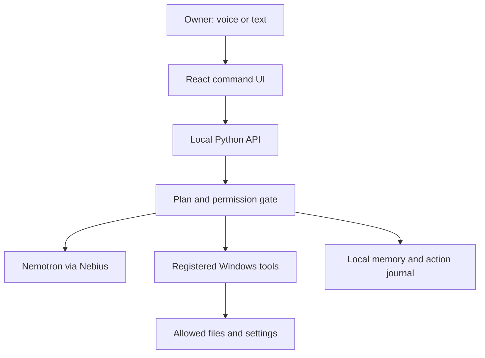

# Architecture and data flow

The first release runs on **Windows**. Its UI may be a locally served React window initially; packaging as a desktop test build follows once the behavior works. A Python backend runs on `127.0.0.1`. If a desktop shell such as Tauri is later added, it must call the same validated backend services. Avoid adding Rust, Electron, and a browser extension just for the first milestone.

## Components

| Component | Responsibility | Boundary |
| --- | --- | --- |
| UI | Capture typed command/audio, display transcription, plan, approvals, undo/history | Cannot directly access model key or arbitrary OS actions |
| Local API | Session, tool registry, model calls, validation, approvals | Binds to loopback with CSRF/origin protections appropriate to packaging |
| Model adapter | Calls a verified NVIDIA model on Nebius; returns structured proposals | Model output is untrusted until validated |
| Policy engine | Resolves paths, checks allowed roots and action scope, issues one-use approval token tied to plan hash | Runs in code before and immediately before execution |
| File adapter | List metadata, propose moves, perform atomic-safe moves, journal, undo | No delete/overwrite/raw arbitrary paths |
| Windows adapter | Narrow setting/app operations with readback and rollback when possible | Only registered operations, not free-form shell |
| Memory store | Preferences, allowed roots, skill versions, run history | SQLite local; user can edit/delete/export |
| Background runner | While local runtime is active, performs a scheduled read-only check and queues a proposal | User can pause; no silent file mutation |
| Wake-word adapter | After user opt-in, detects “Hey Veto” locally from microphone audio | Does not retain/transmit pre-wake audio; visible off switch |
| Speech adapter | Converts the post-wake or push-to-talk request to text, exposes provider and failure | Transcript is reviewed before action; local preferred if viable |
| Spoken response | Reads concise confirmed responses aloud and displays matching text | No voice imitation; can be muted independently |
| Judge demo | Same planner and model adapter, tools aimed at an isolated virtual/sample workspace | No route to developer's Windows machine |

## First schema, subject to implementation review

- `allowed_roots(id, canonical_path, label, created_at, revoked_at)`
- `preferences(id, key, value_json, source, updated_at)`
- `skills(id, name, version, steps_json, enabled, updated_at)`
- `plans(id, user_request, model_id, proposal_json, plan_hash, state, created_at)`
- `actions(id, plan_id, tool, args_json, state, result_json, undo_json, started_at, ended_at)`
- `runs(id, skill_id, trigger, state, started_at, ended_at)`

Use migrations. Do not store full screenshots or microphone recordings by default. Avoid storing API keys in SQLite. Decide whether message drafts require storage and provide deletion.

## Plan-to-action protocol

1. Accept a command or corrected transcript. Provide the model only the relevant allowed folder metadata and preferences; do not upload entire files or screenshots by default.
   When voice is enabled, local wake detection starts one bounded recording; transcription and optional TTS use a separately disclosed provider. A false wake never executes a tool without the same preview and approval as typing.
2. Ask the model for a structured plan from the **fixed tool schemas**. Reject unknown tool names, extra arguments, wrong types, and oversized plans. At most five action steps per request initially.
3. Backend checks the plan against the permission policy. Present a human-readable preview and a hash of exact arguments. The UI cannot silently alter approved arguments.
4. On approval, revalidate current path state, target collisions, allowed roots, and plan hash. Execute one action at a time; record before/after state and result. Show partial failures.
5. Use an idempotency key per step. A retry resumes incomplete work rather than repeating a successful move/send.
6. Stop cancels remaining steps; an in-flight OS operation reports its actual state. The activity journal and undo use confirmed results, never model assumptions.

### Tool examples

- `list_allowed_folder(root_id, relative_path)` returns bounded filename, type, size, and timestamps. No content unless a separate read action is approved.
- `propose_file_moves(root_id, items)` does not mutate. Destination relative paths must stay inside the allowed root or another explicitly allowed root.
- `execute_approved_moves(plan_id, approval_token)` performs the exact reviewed moves and returns receipts.
- `undo_move_batch(action_ids)` checks the current source/destination and conflicts; never overwrites someone else's later change.
- `open_allowed_folder(root_id, relative_path)` opens Explorer at a validated path.
- `get_setting(name)` and `set_setting(name, value)` support only a defined enum, with readback and rollback if supported.
- `create_message_draft(recipient_id, subject, body)` stores/opens a draft; `send_message` does not exist until a verified integration with separate approval is delivered.

## Local versus hosted

The **local build** has access only to Windows capabilities granted by its owner. It is used for the real PC-action recording. The **hosted judge demo** uses sample files in an isolated workspace and the same intent/planning code where practical. Label simulated OS settings in the hosted demo if they cannot affect a real Windows machine; never present them as real. Both paths must show a live Nebius/NVIDIA call. A working downloadable test build is an official-rule-compatible way for judges to exercise actual Windows actions.

## Provider portability after the hackathon

**Current development implementation (5 October):** `VETO_MODE=mock` selects `MockProvider`, a fixed local sample-reply adapter that never constructs an HTTP client. `VETO_MODE=nebius` selects the retained real text adapter. Unknown modes fail startup; live errors do not switch providers. The owner explicitly authorized this temporary second adapter while credits are pending. Every response carries its mode and the UI displays the distinction. No live inference is claimed from mock results.

The file workflow currently uses deterministic buttons and a `SampleFiles` service, separately from chat. SQLite schema version 1 stores one fixed sample-root grant/version/identity, one sorting preference, immutable hashed plans, approval-token hashes, and per-step move identities/receipts. Origin/session checks cover all mutation endpoints. Sort and undo each require a preview and matching approval. Approved execution runs in a worker thread; stop signals are checked between steps. A write-ahead `moving` receipt is reconciled on startup using source/destination identity; interrupted plans never resume automatically. Identical execute retries return recorded outcomes instead of repeating actions. Completed portions of interrupted/stopped/failed sorts can be previewed for undo. No file contents go to either provider, and empty output directories are retained after undo.

The original schema and AI tool-planning protocol above describe later work; the development slice does not expose a model-controlled tool registry or arbitrary folder picker.

Define `ModelProvider.plan(request, tools, context)` and keep the Nebius implementation behind it. Store provider name/model ID with each plan. A future local-model adapter can use the same tool validation and memory; replacing the model must not bypass permission checks. Do not build the second provider before the hackathon gates pass.
